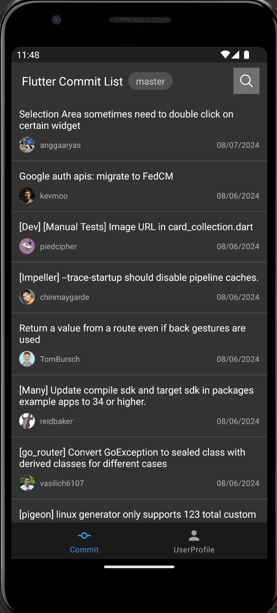
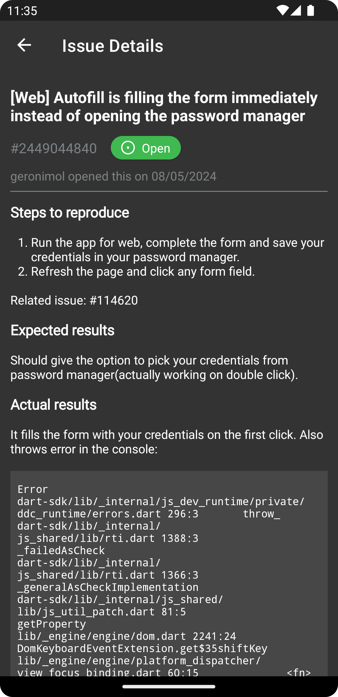

# GitHub Issue Tracker

## Overview
The GitHub Issue Tracker is an advanced android application built to offer an efficient solution for tracking and managing issues across GitHub repositories. It provides users with an organised interface to monitor, search, and address issues, making the process of repository management more effective and user-friendly.

## Features
1. **Comprehensive Issue Overview**: Get a clear overview of issue statuses by accessing a detailed list of all issues in a GitHub repository. Stay up-to-date with key information such as each issue’s title, description, author, creation date, and current status, ensuring you remain informed and organized.

2. **Detailed Issue Information**: Explore detailed information on individual issues, including essential details like the title, description, author, creation date, and current status. This feature equips users with the necessary context to efficiently resolve issues.

3. **Efficient Issue Search**: Effortlessly locate specific issues by searching for keywords within their titles. This powerful search feature allows users to quickly identify and focus on the issues that need attention, improving productivity and response speed.

4. **Pagination Support**: Easily navigate through the list of issues with seamless pagination as users scroll to the bottom of the screen. This feature ensures smooth browsing, even when managing a large number of issues, providing a user-friendly and efficient experience.

## Usage of the Application
1. **Repository Search**: On the home screen, users can initiate a search by clicking the "Search" icon. Additionally, users can search for specific issue titles by entering relevant keywords, streamlining the process of finding issues.

2. **Issue List Display**: The application presents a well-organised list of issues. Each page displays up to 30 issues for easy viewing and enhanced user experience.

3. **Issue Search**: To swiftly locate specific issues, enter relevant keywords in the search bar located at the top of the screen. Activate the search by clicking the "Search" button, allowing you to promptly identify issues that match your criteria.

4. **Issue Details**: To gain a detailed understanding of any issue, simply tap on the issue entry. This action opens a new screen displaying a comprehensive overview, providing users with the necessary information to make informed decisions.

## Technology Used
- **MVVM Architecture**: The application is built using the MVVM (Model-View-ViewModel) architecture, promoting a clear separation of concerns and ensuring a well-organized, scalable development process.

- **Data Collection**: The application utilizes the [GitHub API](https://api.github.com) to collect and display issue-related data in an organized manner for easy access and review.

- **Network Communication**: [Retrofit](https://github.com/square/retrofit) acts as the core communication framework, enabling smooth and efficient interaction with the GitHub API for data retrieval and integration.

- **Image Loading**: [Glide](https://github.com/bumptech/glide) optimizes the user experience by seamlessly loading and displaying images in view components with efficiency.

- **Markdown Rendering**: [Markwon](https://github.com/noties/Markwon) guarantees precise rendering of markdown content, ensuring that issue descriptions are clearly formatted and easy to read.

## Screenshots

 